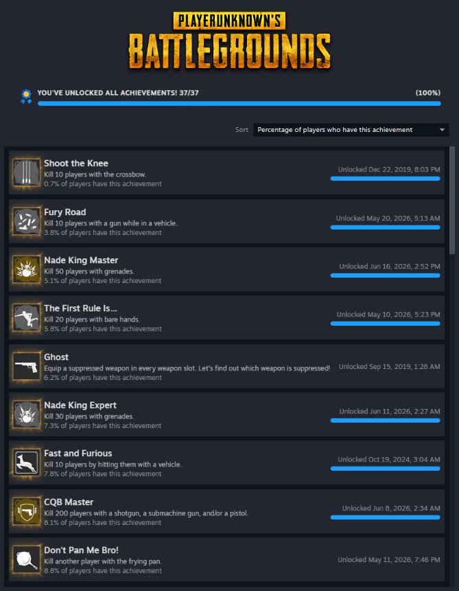

# PUBG Steam Achievements


<p align="center">
  
</p>

A browser-based, sortable view of my **PUBG: BATTLEGROUNDS** achievements on Steam. The Steam client shows achievements in a fixed order with no way to re-order them; this site takes the same 37 records and presents them in a single scrolling card whose order you choose from a dropdown, by rarity, by name, by description, or by unlock date.

Open the list: [PUBG: BATTLEGROUNDS Steam Achievements](https://rohingosling.github.io/pubg-steam-achievements/)


## 🚀 Running Locally

No toolchain is required. Just clone the repository:

```
git clone https://github.com/rohingosling/pubg-steam-achievements.git
cd pubg-steam-achievements
```

Then open `src/index.html` directly in a browser — it is designed to work over `file://` — or serve that directory if you prefer a real HTTP origin:

```
cd src
python -m http.server 8000
```

...and browse to `http://localhost:8000/`.

The site is served from `src/`, but the published URL has no `src/` segment in it: GitHub Pages deploys that directory *as* the site root, via `.github/workflows/pages.yml`.

## 📁 Project Structure

```
pubg-steam-achievements
├─ .github/workflows        Deployment.
│  └─ pages.yml             Publishes src/ to GitHub Pages as the site root.
│
├─ src                      The site. Served as the root of the published URL.
│  ├─ index.html            Single page entry point.
│  ├─ css                   Presentation.
│  │  ├─ tokens.css         Palette, geometry, and typography tokens.
│  │  ├─ layout.css         Card, banner stack, control bar, list frame and viewport.
│  │  └─ components.css     Sort control, achievement row, scrollbar.
│  │
│  ├─ js                    Behaviour.
│  │  ├─ sort-fields.js     The four sort fields and their comparators.
│  │  ├─ list-view.js       Row construction and reordering.
│  │  └─ app.js             Bootstrap and event wiring.
│  │
│  ├─ data                  Content.
│  │  └─ achievements.js    The 37 achievement records.
│  │
│  └─ images                Assets.
│     ├─ ui                 Page chrome: wordmark, reward banner.
│     ├─ items/flat         37 row images, 794 x 80.
│     ├─ screenshots        The screenshot shown at the top of this README.
│     └─ hero.png           Placeholder banner. Not referenced by the page.
│
├─ README.md                This document.
└─ LICENSE                  MIT licence.
```

## 📜 License

Released under the [MIT License](LICENSE) — Copyright © 2026 Rohin Gosling.

- **PUBG: BATTLEGROUNDS** is a trademark of KRAFTON, Inc.
- **Steam** is a trademark of Valve Corporation.

This is an unaffiliated personal project; achievement names, descriptions, and icon artwork remain the property of their respective owners.

